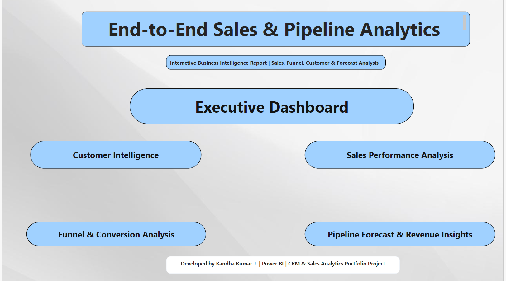
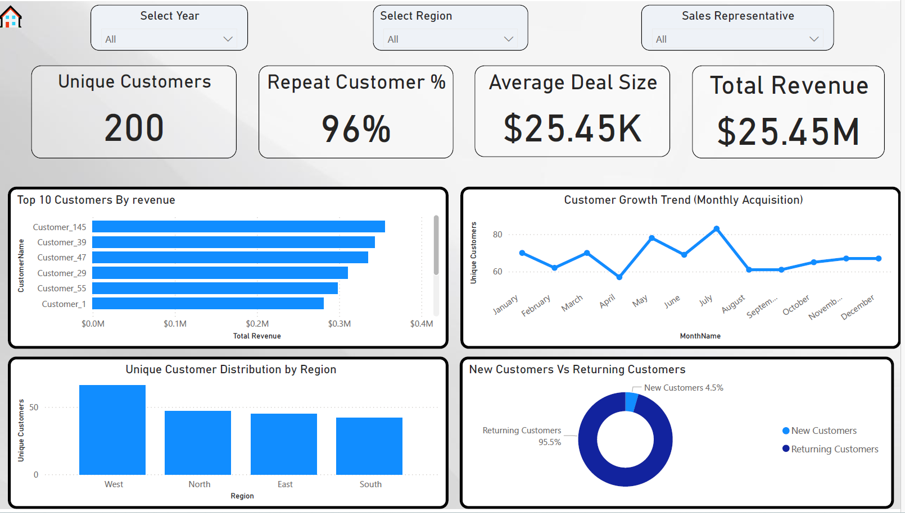
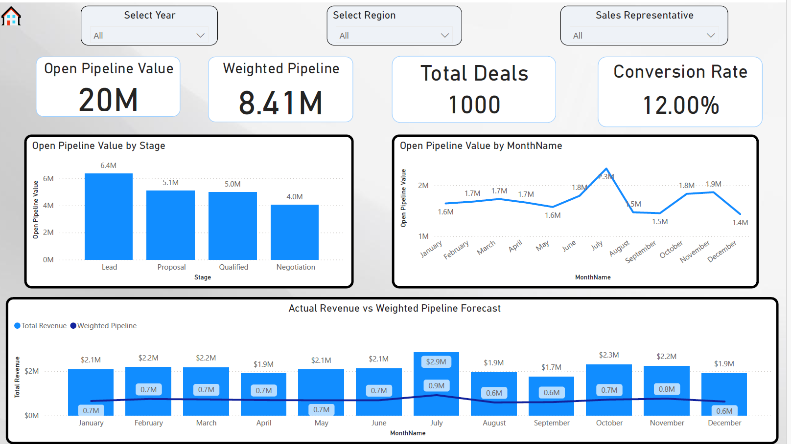
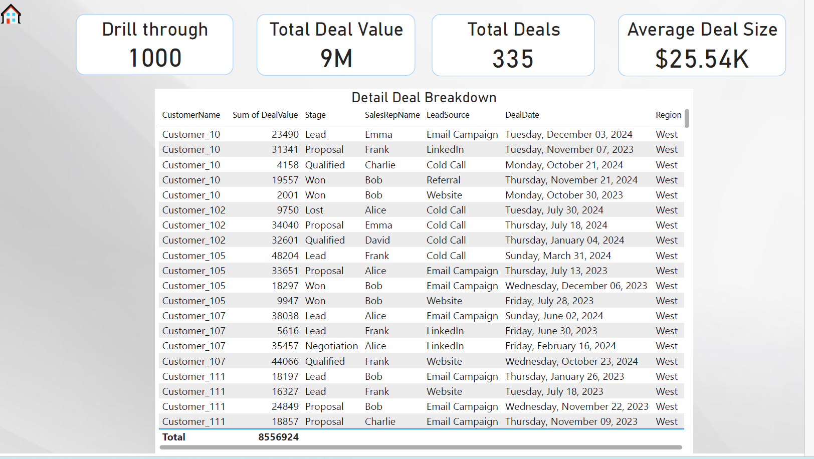

# 📊 End-to-End CRM Sales & Pipeline Analytics Dashboard (Power BI)

## 🧭 Project Overview
This project presents an end-to-end Business Intelligence solution built using Power BI to analyze CRM sales data, customer retention, sales funnel performance, and revenue pipeline forecasting.

The dashboard is designed from a business decision-making perspective, focusing on executive KPIs, conversion optimization, and customer intelligence rather than generic visual reporting.

---

## 🎯 Business Problem
Organizations often struggle with:
- Low conversion rates across sales funnel stages
- Poor visibility into pipeline value and deal progression
- Lack of insights into customer retention and repeat behavior
- Inefficient tracking of revenue trends and lead sources

This dashboard solves these challenges by delivering interactive, KPI-driven insights for sales leadership and business stakeholders.

---

## 🛠 Tools & Technologies Used
- Power BI (Dashboard Development)
- DAX (Advanced Measures & KPIs)
- Power Query (Data Transformation)
- Data Modeling (Star Schema)
- Excel / CRM Dataset (Simulated Business Data)

---

## 🧠 Skills Demonstrated
- Business Intelligence & KPI Analytics
- Advanced DAX (CALCULATE, SWITCH, FILTER, SUMX)
- Star Schema Data Modeling
- Sales Funnel & Conversion Analysis
- Customer Retention & Cohort Insights
- Interactive Dashboard Design (Drillthrough, Slicers)
- Executive-Level Reporting

---

## 📊 Dashboard Preview

### 🏠 Executive Dashboard

### 📈 Sales Performance Analysis

### 🔍 Funnel & Conversion Analysis

### 👥 Customer Intelligence

### 📊 Pipeline Forecast & Revenue Insights

### 📑 Drillthrough – Deal Level Details

---

## 🏗 Data Modeling Approach
A structured star schema data model was implemented to ensure performance and scalability:

- Fact Table: Deals / Transactions
- Dimension Tables: Customers, Date, Sales Representatives, Region, Lead Source
- Relationships: One-to-Many with optimized filter direction
- Dedicated Date Table created and marked as Date Table for time intelligence

This approach enables accurate KPI calculations and efficient report performance.

---

## 📈 Key Business KPIs Developed (DAX)
- Total Revenue
- Total Deals
- Conversion Rate %
- Won Deals vs Lost Deals
- Average Deal Size
- Weighted Pipeline Value
- Repeat Customer %
- Monthly Revenue Trend
- Funnel Drop-off Analysis

Advanced DAX functions used:
- CALCULATE()
- SWITCH()
- FILTER()
- SUMX()
- DIVIDE()
- Time Intelligence Functions

---

## 🔎 Key Insights Generated
- Identified highest revenue-generating regions and sales representatives  
- Analyzed funnel drop-offs across Lead → Qualified → Proposal → Won stages  
- Measured customer retention and repeat purchase behavior  
- Evaluated lead source effectiveness on conversion rates  
- Forecasted pipeline value using weighted deal probabilities  
- Tracked monthly revenue trends for strategic planning  

---

## 💼 Business Impact
- Enables data-driven sales strategy decisions  
- Improves visibility into pipeline health and deal progression  
- Helps leadership identify bottlenecks in the sales funnel  
- Supports revenue forecasting and performance optimization  

---

## 📁 Repository Structure
crm-sales-powerbi-analytics-dashboard/
│
├── README.md # Main project documentation
├── README.txt # Backup text version
├── End-to-End CRM Dashboard.pbix # Power BI dashboard file
│
├── Images/ # Dashboard screenshots
│ ├── Home_Page.png
│ ├── Funnel_Conversion.png
│ ├── Customer_Intelligence.png
│ ├── Pipeline_Forecast.png
│ ├── Drillthrough.png
│ └── Power_BI_Service_Dashboard.png
│
└── docs/
└── Project_Report_PowerBI.docx # Detailed project report
---

## 🚀 How to Use the Dashboard
1. Download the `.pbix` file from the repository  
2. Open using Microsoft Power BI Desktop  
3. Interact with slicers (Year, Region, Sales Rep)  
4. Navigate across report pages for detailed analysis  
5. Use drillthrough feature for deal-level insights  

---

## 📌 Project Highlights (For Recruiters)
- Business-focused dashboard (Not a generic dataset project)
- Domain-aligned with Sales & CRM Analytics
- End-to-end BI solution (Data Modeling → DAX → Visualization)
- Interactive multi-page dashboard with executive insights

---

## 👨‍💼 Author
**Kandha Kumar J**  
Data Analyst | Power BI | SQL | Business Analytics  

This project is part of my transition from Sales Leadership to Data Analytics, leveraging domain expertise in KPI reporting, performance analysis, and business intelligence.
